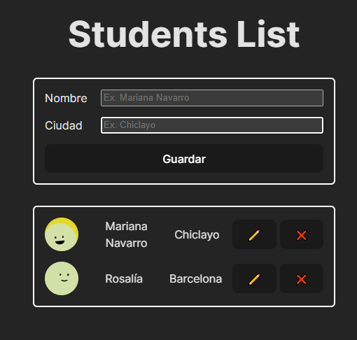

# React Student List (Reto)

**Requerimientos**
Herramienta para listar estudiantes con su nombre y ciudad, es una herramienta en la que podemos listar, crear, editar y  eliminar. Usar una solución en memoria(localstorage) dentro de un array de estudiantes. 

This template provides a minimal setup to get React working in Vite with HMR and some ESLint rules.

Currently, two official plugins are available:

- [@vitejs/plugin-react](https://github.com/vitejs/vite-plugin-react/blob/main/packages/plugin-react/README.md) uses [Babel](https://babeljs.io/) for Fast Refresh
- [@vitejs/plugin-react-swc](https://github.com/vitejs/vite-plugin-react-swc) uses [SWC](https://swc.rs/) for Fast Refresh
